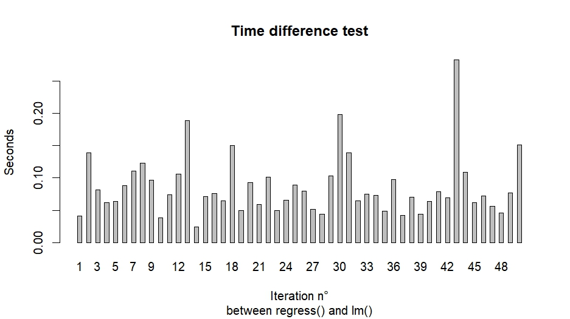
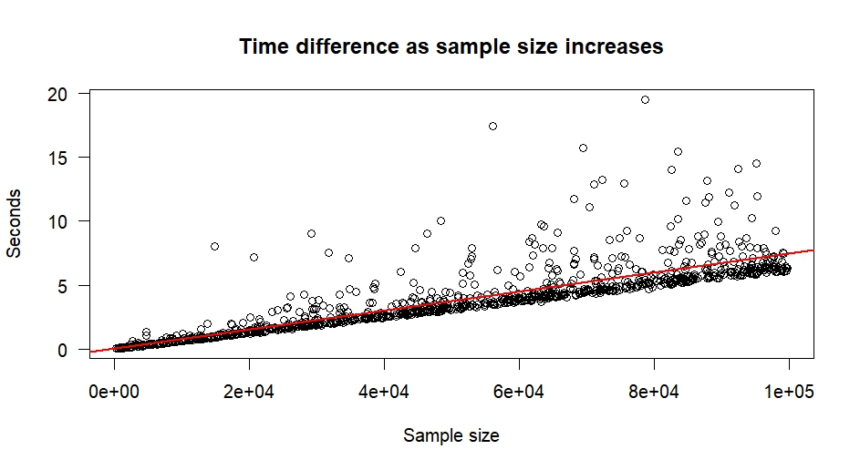

## Introduction

The first step in this project is to create the data generating process that the function will estimate. This is done by specifying a random variable $X$ and creating another variable, called the dependent variable, that will be a function of that random variable, written as $Y = f(X)$.

In order to match the standard literature in my courses, a capital letter $X_{i}$ will denote a random variable while it realization will be denoted by a small letter $x_{i}$.

The independent variable will be a normally distributed variable with the following mean and variance $X_{i} \backsim N(3, \sqrt{2})$. The dependent variable $Y$ will depend on $X$ according to this equation:

$$
Y_{i} = 3 + 2 \times X_{i} + \epsilon_{i}
$$

where $\epsilon_{i} \backsim N(0, 1)$ is a standard normal disturbance term and $3$ can essentially be considered as the intercept.

## An implementation in R

### The linear regression

A simple regression model is an equation of the following form:

$$
\tag{1}
Y_{i} = \alpha + \beta x_{i} \qquad \forall i = 1, \dots, n
$$

The estimator for the intercept $\alpha$ is given by equation $(2)$ where $\bar{x}$ refers to the mean of the random variable $x_{i}$.

$$
\tag{2}
\alpha = \bar{y} - \beta \bar{x}
$$

The estimator of the second coefficient is given by the covariance between the two variables over the variance of the independent variable.

$$
\tag{3}
\beta = \frac {\text{Cov}(x_{i}, y_{i}) / (n - 1)}{\text{Var}(x_{i}) / (n - 1)}
$$

### The regression algorithm

The code starts by defining the two variables according to the data generating process outlined above.

```r
x <- rnorm(n = 300, mean = 3, sd = sqrt(2))

y <- 3 + 2*x + rnorm(n = 300, mean = 0, sd = 1)
```

The algorithm is a function that takes the following arguments:

```r
regress <- function(y, x, beta = c(0, 0), alpha = 0.05) {...}
```

where $y$ and $x$ are obviously the regressand and the regressor respectively. The algorithm also includes some basic hypothesis testing on the slope coefficient. The argument ```beta = c(0, 0)``` serves as the default null hypothesis present in many introductory econometrics textbooks:

$$
\begin{split}
H_{0}:& \beta \leq 0 
\\
H_{1}:& \beta \gt 0
\end{split}
$$

The last argument is the desired significance level of the confidence interval. The argument is set to $0.05$ such that the function returns the $95\%$ cofidence interval automatically.

The first step of the algorithm is to transform the vectors of variables into a dataframe and to get the size the of dataframe. Then, the function calculates the mean of each column as they will later be useful to compute the intercept.


```r
dataset <- data.frame(y, x)

# Sample Size
n <- nrow(dataset)

# Find mean of data
meanX <- mean(dataset[, 2])
meanY <- mean(dataset[, 1])
```

The next step is to compute the estimates of the coefficients by calculating the covariance and the variance. For now, only the relevant information for the hypothesis testing on the slope is computed.

```r
  # Calculating Beta 
  Covariance <- sum((x - meanX) * (y - meanY))
  Variance <- sum((x - meanX) ^ 2)
  
  # Calculating Estimators 
  slope <- Covariance / Variance
  intercept <- meanY - slope * meanX 
  
  # Calculate error term
  error <- rep(0, n)
  for (i in 1:n){
    error[i] <- dataset[i, 1] - intercept -  slope * dataset[i, 2]
  }
  
  # SE of Slope
  var.slope <- sum(error^2) / ((n - 2) * Variance)
  se.slope <- sqrt(var.slope)
  
  # T(X) of Slope
  T.slope <- (slope - beta[2]) / se.slope
  
  # P-value of T(X)
  p.slope <- pt(T.slope, df = n - 1, lower.tail = FALSE)
  
  # Confidence Interval for slope
  p <- alpha / 2
  level <- 1 - alpha
  
  # Bounds
  Lower <- slope - qt(p, n - 1, lower.tail = FALSE) * se.slope  
  Upper <- slope + qt(p, n - 1, lower.tail = FALSE) * se.slope 
 
  # Residuals
  minResid = min(error)
  medResid = median(error)
  maxResid = max(error)
  meanResid = mean(error)
  seResid = sd(error)

  # SE of Intercept
  var.intercept = ((seResid^2) * sum(x^2)) / (n * Variance)
  se.intercept = sqrt(var.intercept)

  # T(X) of intercept
  T.intercept = (intercept - beta[1]) / se.intercept

  # P-value of T(X)
  p.intercept <- pt(T.intercept, df = n - 1, lower.tail = FALSE)

  # Confidence Interval for intercept
  # Bounds
  Lower.int <- intercept - qt(p, n - 1, lower.tail = FALSE) * se.intercept 
  Upper.int <- intercept + qt(p, n - 1, lower.tail = FALSE) * se.intercept

```

All the relevant variables are then stored into two dataframe (for aesthetic purposes) and then return to the console. The output looks as follows:

```r
> regress(y,x)
Regression: 
Method: Ordinary Least Squares

          Estimate  Std error  T value       P value Lower Bound Upper Bound
Intercept 3.181974 0.13644347 23.32082  1.477051e-69    2.913463    3.450485
Slope     1.943636 0.04068251 47.77571 2.671410e-142    1.863576    2.023696

Residuals: 
       Min     Median      Max |          Mean Std Error
 -2.179113 -0.0529923 2.675941 | -4.937692e-17 0.9753686
```

In order to check the accuracy of the algorithm, I test against the standard ```lm()``` function. The output looks quite similar and is shown below:

```r
Call:
lm(formula = y ~ x)

Residuals:
     Min       1Q   Median       3Q      Max 
-2.17911 -0.65643 -0.05299  0.69130  2.67594

Coefficients:
            Estimate Std. Error t value Pr(>|t|)
(Intercept)  3.18197    0.13667   23.28   <2e-16 ***
x            1.94364    0.04068   47.78   <2e-16 ***
---
Signif. codes:  0 '***' 0.001 '**' 0.01 '*' 0.05 '.' 0.1 ' ' 1

Residual standard error: 0.977 on 298 degrees of freedom
Multiple R-squared:  0.8845,    Adjusted R-squared:  0.8841
F-statistic:  2283 on 1 and 298 DF,  p-value: < 2.2e-16

> confint(test, level = 0.95)
               2.5 %   97.5 %
(Intercept) 2.913009 3.450939
x           1.863575 2.023698
```

### Testing the performance

Unfortunately, despite the accurate results the ```regress()``` function is much slower than the standard ```lm()``` algorithm. The speed test was made using the following function:

```r
speed <- function(n = 10){

time <- rep(0, n)
timeR <- rep(0, n)
timeLM <- rep(0, n)

for (i in 1:n){

  # Sample creation
  x <- rnorm(n = 300, mean = 3, sd = sqrt(2))
  y <- 3 + 2*x + rnorm(n = 300, mean = 0, sd = 1)

  # Regress()
  startR <- Sys.time()
  regress(y, x)
  endR <- Sys.time()

  # Time Difference for regress()
  timeR[i] <- endR - startR

  # lm()
  startLM <- Sys.time()
  test <- lm(y ~ x)
  summary(test)
  confint(test, level = 0.95)
  endLM <- Sys.time()

  # Time Difference for lm()
  timeLM[i] <- endLM - startLM

  # Compare
  time[i] <- timeR[i] - timeLM[i]

}

output <- data.frame(timeR, timeLM, time)
colnames(output) <- c("regress()", "lm()", "Difference")

return(output)
}
```

For 50 iterations, the mean time difference between the two algorithms was $0.08623026$ seconds while the time differences fluctuated between $0.02424502$s and $0.28250098$s.



The second function will compare the speed of the ```regress()``` function as the sample size increases.

```r
performance <- function(n = 10, m = 1000){

time <- rep(0, n)
timeR <- rep(0, n)
timeLM <- rep(0, n)
size <- rep(0, n)

for (i in 1:n){

  j <- round(runif(1, min = 300, max = m), 0)
  
  # Sample creation
  x <- rnorm(n = j, mean = 3, sd = sqrt(2))
  y <- 3 + 2*x + rnorm(n = j, mean = 0, sd = 1)

  # Regress()
  startR <- Sys.time()
  regress(y, x)
  endR <- Sys.time()

  # Time Difference for regress()
  timeR[i] <- endR - startR

  # lm()
  startLM <- Sys.time()
  test <- lm(y ~ x)
  summary(test)
  confint(test, level = 0.95)
  endLM <- Sys.time()

  # Time Difference for lm()
  timeLM[i] <- endLM - startLM

  # Compare
  time[i] <- timeR[i] - timeLM[i]
  size[i] <- j
  
  count <- i
  count

}

output <- data.frame(timeR, timeLM, time, size)
colnames(output) <- c("regress()", "lm()", "Difference", "Sample size")

output <- output[order(output[, 4]),]

return(output)

}
```

The performance test is iterated $1000$ times and the plot shows the relationship between the sample size and the number of seconds the algorithm takes to run.



The linear model performed on this data shows that an increase in the sample size by $1000$ observations leads to a $0.074$ second increase in runtime of ```regress()``` which is much larger than for the ```lm()``` function for which it only increased by $0.00236$ seconds. This is a sign that the ```regress()``` algorithm is not the most efficient one (by far).

## An implementation in Julia

## References


